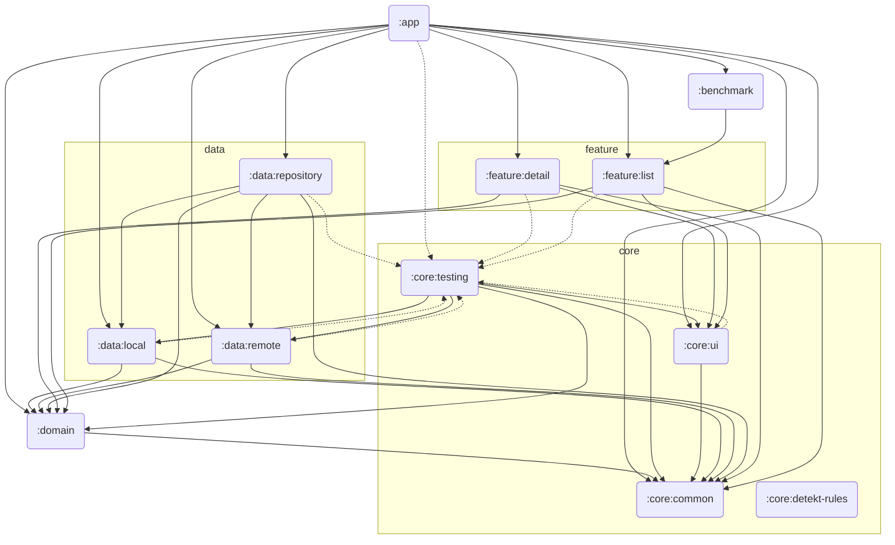

# Module Dependency Graph

```mermaid
graph TD
  _app(":app")
  _benchmark(":benchmark")
  _domain(":domain")

  subgraph core
    _core_common(":core:common")
    _core_detekt-rules(":core:detekt-rules")
    _core_testing(":core:testing")
    _core_ui(":core:ui")
  end

  subgraph data
    _data_local(":data:local")
    _data_remote(":data:remote")
    _data_repository(":data:repository")
  end

  subgraph feature
    _feature_detail(":feature:detail")
    _feature_list(":feature:list")
  end

  _app -.-> _core_testing
  _app --> _benchmark
  _app --> _feature_detail
  _app --> _feature_list
  _app --> _domain
  _app --> _data_local
  _app --> _data_remote
  _app --> _data_repository
  _app --> _core_common
  _app --> _core_ui
  _benchmark --> _feature_list
  _domain --> _core_common
  _core_testing --> _domain
  _core_testing --> _data_remote
  _core_testing --> _data_local
  _core_testing --> _core_common
  _core_testing --> _core_ui
  _core_ui --> _core_common
  _core_ui -.-> _core_testing
  _data_local --> _domain
  _data_local --> _core_common
  _data_local -.-> _core_testing
  _data_remote --> _domain
  _data_remote --> _core_common
  _data_remote -.-> _core_testing
  _data_repository --> _domain
  _data_repository --> _data_local
  _data_repository --> _data_remote
  _data_repository --> _core_common
  _data_repository -.-> _core_testing
  _feature_detail -.-> _core_testing
  _feature_detail --> _domain
  _feature_detail --> _core_ui
  _feature_detail --> _core_common
  _feature_list -.-> _core_testing
  _feature_list --> _domain
  _feature_list --> _core_common
  _feature_list --> _core_ui
```
