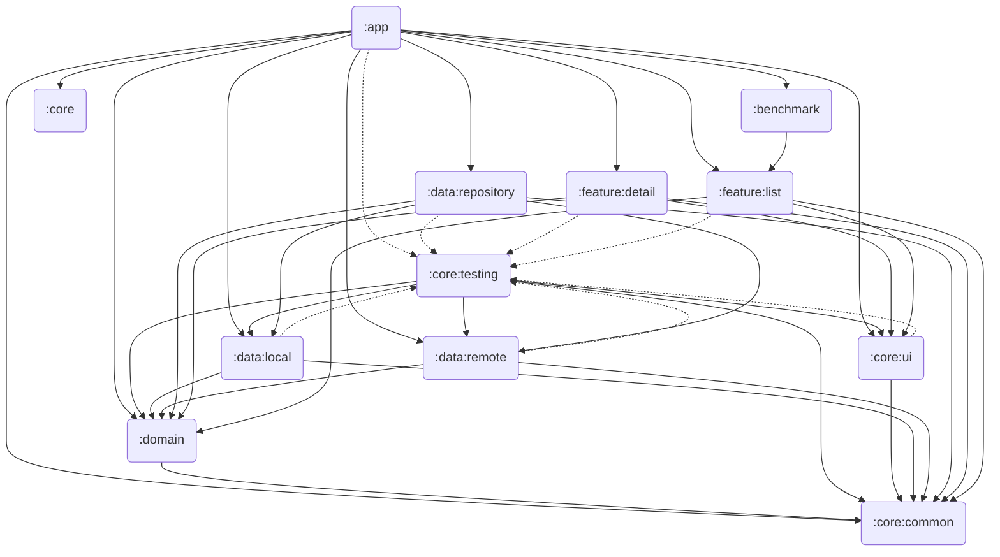

# Module Dependency Graph

```mermaid
graph TD
  _app(":app") -.-> _core_testing(":core:testing")
  _app(":app") --> _benchmark(":benchmark")
  _app(":app") --> _feature_detail(":feature:detail")
  _app(":app") --> _feature_list(":feature:list")
  _app(":app") --> _domain(":domain")
  _app(":app") --> _data_local(":data:local")
  _app(":app") --> _data_remote(":data:remote")
  _app(":app") --> _data_repository(":data:repository")
  _app(":app") --> _core_common(":core:common")
  _app(":app") --> _core_ui(":core:ui")
  _app(":app") --> _core(":core")
  _benchmark(":benchmark") --> _feature_list(":feature:list")
  _domain(":domain") --> _core_common(":core:common")
  _core_testing(":core:testing") --> _domain(":domain")
  _core_testing(":core:testing") --> _data_remote(":data:remote")
  _core_testing(":core:testing") --> _data_local(":data:local")
  _core_testing(":core:testing") --> _core_common(":core:common")
  _core_testing(":core:testing") --> _core_ui(":core:ui")
  _core_ui(":core:ui") --> _core_common(":core:common")
  _core_ui(":core:ui") -.-> _core_testing(":core:testing")
  _data_local(":data:local") --> _domain(":domain")
  _data_local(":data:local") --> _core_common(":core:common")
  _data_local(":data:local") -.-> _core_testing(":core:testing")
  _data_remote(":data:remote") --> _domain(":domain")
  _data_remote(":data:remote") --> _core_common(":core:common")
  _data_remote(":data:remote") -.-> _core_testing(":core:testing")
  _data_repository(":data:repository") --> _domain(":domain")
  _data_repository(":data:repository") --> _data_local(":data:local")
  _data_repository(":data:repository") --> _data_remote(":data:remote")
  _data_repository(":data:repository") --> _core_common(":core:common")
  _data_repository(":data:repository") -.-> _core_testing(":core:testing")
  _feature_detail(":feature:detail") -.-> _core_testing(":core:testing")
  _feature_detail(":feature:detail") --> _domain(":domain")
  _feature_detail(":feature:detail") --> _core_ui(":core:ui")
  _feature_detail(":feature:detail") --> _core_common(":core:common")
  _feature_list(":feature:list") -.-> _core_testing(":core:testing")
  _feature_list(":feature:list") --> _domain(":domain")
  _feature_list(":feature:list") --> _core_common(":core:common")
  _feature_list(":feature:list") --> _core_ui(":core:ui")
```
